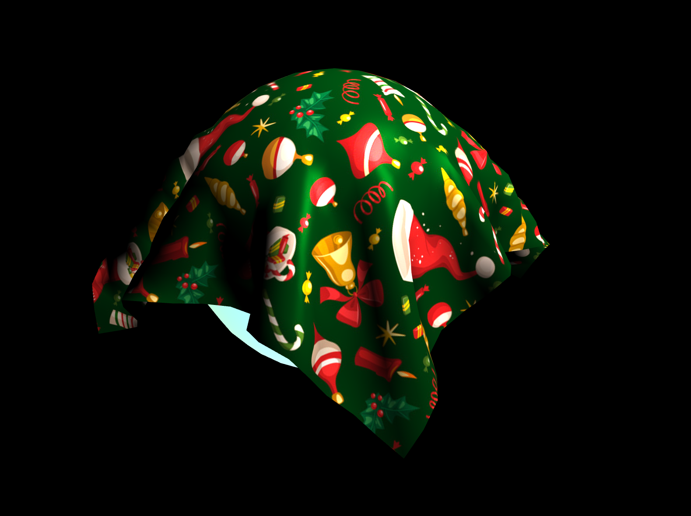

### `/Wireframe`  *(base)*
__simple cloth based on mass-spring model__

 

### `/Normal`  *(update)*
__fragment color as normal vector from mesh__

 

### `/Light`  *(update)*
__load texture image and implement blinn phong lighting model__

 

### `/Collision`  *(update)*
__self collide and collide with sphere__

