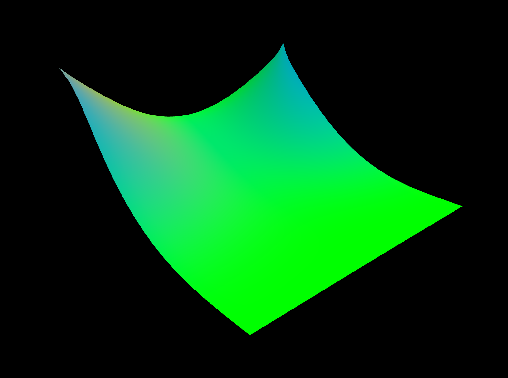

### [`/Wireframe`](https://github.com/Wayne716/Graphics/tree/master/Cloth%20Simulator/Code/Wireframe)  *(base)*
__simple cloth based on mass-spring model__

 

### [`/Normal`](https://github.com/Wayne716/Graphics/tree/master/Cloth%20Simulator/Code/Normal)  *(update)*
__fragment color as normal vector from mesh__

 

### [`/Lighting`](https://github.com/Wayne716/Graphics/tree/master/Cloth%20Simulator/Code/Lighting)  *(update)*
__load texture image and implement blinn phong lighting model__

 

### [`/Collision`](https://github.com/Wayne716/Graphics/tree/master/Cloth%20Simulator/Code/Collision)  *(final)*
__self collide and collide with sphere__

